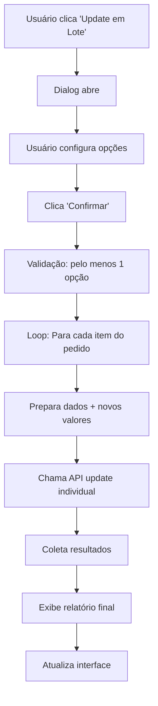

# 🚀 Funcionalidade de Update em Lote - Guia Completo

## 📋 Visão Geral

A nova funcionalidade permite atualizar **todos os itens de um pedido de uma só vez**, economizando tempo quando você precisa aplicar a mesma alteração para vários itens do mesmo cliente.

## 🎯 Onde Encontrar

```
Pedidos agrupados por número
├── [Botão: Atualizar Dados]
└── Acordeão
    ├── Pedido 123 | ID: 123 | Cliente: João Silva
    │   ├── [🔄 Update em Lote (3 itens)] ← NOVO BOTÃO
    │   ├── Item 1 [ID Produto] [ID Cliente] [Nome] [Qtd] [Valor] [Pago] [🗑️] [💾]
    │   ├── Item 2 [ID Produto] [ID Cliente] [Nome] [Qtd] [Valor] [Pago] [🗑️] [💾]
    │   └── Item 3 [ID Produto] [ID Cliente] [Nome] [Qtd] [Valor] [Pago] [🗑️] [💾]
    └── Pedido 124 | ID: 124 | Cliente: Maria Santos
        └── [🔄 Update em Lote (2 itens)] ← NOVO BOTÃO
```

## 🔄 Como Usar

### 1. **Localizar o Botão**
- Cada pedido expandido agora tem um botão **"Update em Lote (X itens)"**
- O botão fica no topo da lista de itens do pedido

### 2. **Abrir Dialog de Configuração**
Ao clicar no botão, abre um dialog com opções:

```
┌─────────────────────────────────────┐
│ Update em Lote                      │
├─────────────────────────────────────┤
│ Update em Lote - João Silva         │
│ Pedido: 123 (3 itens)              │
│ ─────────────────────────────────── │
│ ☐ Marcar todos como pagos          │
│ ID Cliente para todos: [_________]  │
│                                     │
│ ─────────────────────────────────── │
│              [Confirmar] [Cancelar] │
└─────────────────────────────────────┘
```

### 3. **Configurar Ações**
- **☑️ Marcar todos como pagos**: Marca todos os itens como "pago = true"
- **📝 ID Cliente para todos**: Aplica o mesmo ID de cliente para todos os itens

### 4. **Confirmar e Executar**
- Clique em **"Confirmar"** para executar
- O sistema atualiza todos os itens automaticamente
- Mensagem de sucesso/erro é exibida

## ⚡ Cenários de Uso

### **Cenário 1: Marcar Pedido Completo como Pago**
```
Situação: Cliente pagou todo o pedido
Ação: ☑️ "Marcar todos como pagos"
Resultado: Todos os 5 itens ficam com status "Pago = ✅"
```

### **Cenário 2: Transferir Pedido para Outro Cliente**
```
Situação: Pedido foi transferido do cliente ID 123 para ID 456
Ação: Digitar "456" em "ID Cliente para todos"
Resultado: Todos os itens ficam com id_cliente = "456"
```

### **Cenário 3: Operação Combinada**
```
Situação: Transferir pedido E marcar como pago
Ação: ☑️ "Marcar todos como pagos" + "456" no ID Cliente
Resultado: Todos os itens transferidos E marcados como pagos
```

## 🔍 Fluxo Técnico



## 📊 Relatório de Resultados

Após execução, o sistema mostra:

- **✅ Sucesso Total**: `"✅ Todos os 3 itens atualizados com sucesso!"`
- **⚠️ Sucesso Parcial**: `"⚠️ 2 sucessos, 1 erros"`
- **❌ Erro**: `"Erro no update em lote: [detalhes]"`

## 🛡️ Validações e Segurança

### **Validações Implementadas**
- ✅ Verifica se pelo menos uma opção foi selecionada
- ✅ Valida IDs de pedido antes de processar
- ✅ Trata erros individuais sem parar o processo
- ✅ Limpa cache após alterações

### **Tratamento de Erros**
- Erros em itens individuais não param o processo
- Relatório detalhado de sucessos e falhas
- Cache invalidado automaticamente
- Interface atualizada com dados frescos

## 🚀 Vantagens da Implementação

### **Para o Usuário**
- **⏱️ Economia de Tempo**: Update de 10 itens em 1 clique vs 10 cliques
- **🎯 Consistência**: Garante mesmo valor para todos os itens
- **📊 Feedback**: Relatório claro de sucessos/erros
- **🔄 Flexibilidade**: Pode escolher quais campos atualizar

### **Para o Sistema**
- **🔧 Reutilização**: Usa mesma lógica do update individual
- **🗃️ Cache**: Invalidação inteligente
- **🛡️ Segurança**: Validações mantidas
- **📈 Performance**: Operações em lote otimizadas

## 💡 Próximas Melhorias Possíveis

1. **📝 Mais Campos**: Adicionar quantidade em lote
2. **🔍 Preview**: Mostrar quais itens serão alterados
3. **📋 Templates**: Salvar configurações frequentes
4. **📊 Logs**: Histórico de operações em lote
5. **🔒 Confirmação**: Dialog de confirmação adicional para operações grandes

## 🎉 Conclusão

A funcionalidade de **Update em Lote** torna o gerenciamento de pedidos muito mais eficiente, especialmente para:

- 🏪 **Lanchonetes** com pedidos grandes
- 💰 **Fechamento de caixa** em lote
- 📞 **Transferência de pedidos** entre clientes
- ⚡ **Operações repetitivas** otimizadas

A implementação é **robusta**, **user-friendly** e **mantém a consistência** com o resto do sistema!
